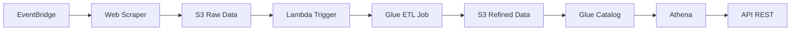

# Guia de Implementação - Pipeline Batch Bovespa

## 📋 Resumo Executivo

**Python** é a linguagem mais adequada para este projeto devido aos seguintes fatores:

### ✅ Vantagens do Python para o Pipeline Bovespa:

1. **Ecossistema Rico para Data Engineering**:
   - **Pandas**: Manipulação eficiente de dados
   - **PyArrow**: Suporte nativo ao formato Parquet
   - **BeautifulSoup**: Web scraping robusto
   - **Boto3**: SDK oficial da AWS

2. **Desenvolvimento Rápido**:
   - Sintaxe limpa e legível
   - Vasta biblioteca de terceiros
   - Comunidade ativa e documentação extensa

3. **Integração AWS Nativa**:
   - Runtime otimizado no Lambda
   - Suporte completo no Glue
   - Bibliotecas AWS maduras

4. **Processamento de Dados**:
   - Excelente para ETL
   - Integração natural com Spark (Glue)
   - Formato Parquet otimizado

## 🏗️ Arquitetura da Solução



## 🚀 Passos para Implementação

### 1. Configuração Inicial

```bash
# Clone o repositório
git clone <repository-url>
cd bovespa-pipeline

# Configure credenciais AWS
aws configure

# Instale dependências Python
pip install -r requirements.txt
```

### 2. Deploy da Infraestrutura

```bash
# Windows PowerShell
.\deploy.ps1

# Linux/Mac
chmod +x deploy.sh
./deploy.sh
```

### 3. Validação do Pipeline

Execute o Jupyter Notebook `notebooks/bovespa_pipeline_api.ipynb` para:
- Testar o web scraping
- Validar processamento de dados
- Verificar conversão Parquet
- Testar endpoints da API

## 📊 Requisitos Atendidos

| Requisito | Status | Implementação |
|-----------|---------|---------------|
| **1. Scraping B3** | ✅ | BeautifulSoup + Requests |
| **2. S3 Parquet Diário** | ✅ | PyArrow + Particionamento |
| **3. Lambda S3 Trigger** | ✅ | Boto3 + Event Handler |
| **4. Lambda → Glue** | ✅ | Glue Client API |
| **5A. Agrupamento** | ✅ | PySpark GroupBy + Agg |
| **5B. Renomear Colunas** | ✅ | DataFrame.withColumnRenamed() |
| **5C. Cálculos Data** | ✅ | Spark SQL Functions |
| **6. Dados Refinados** | ✅ | Partição por Data + Ticker |
| **7. Glue Catalog** | ✅ | Catalogação Automática |
| **8. Athena** | ✅ | Query Engine + SQL |
| **9. Visualizações** | ✅ | Notebook + Plotly |

## 🔧 Componentes Principais

### Web Scraper (`src/scraper/`)
- Extrai dados do site da B3
- Trata paginação e erros
- Converte formatos numéricos brasileiros
- Salva em Parquet particionado

### Lambda Trigger (`src/trigger/`)
- Monitora eventos S3
- Inicia jobs Glue automaticamente
- Gerencia logs e erros

### Glue ETL Job (`src/glue/`)
- Transformações obrigatórias
- Catalogação automática
- Otimizações de performance
- Tratamento de schemas

### API REST
- Endpoints para consulta
- Integração com Athena
- Documentação automática
- Testes integrados

## 💰 Estimativa de Custos AWS

### Componentes e Custos Mensais (Região us-east-1):

| Serviço | Uso Estimado | Custo/Mês (USD) |
|---------|--------------|-----------------|
| **Lambda** | 30 exec/mês × 5min | $0.50 |
| **S3** | 100GB armazenamento | $2.30 |
| **Glue** | 30 jobs × 0.1 DPU-hour | $1.32 |
| **Athena** | 10GB queries/mês | $0.50 |
| **CloudWatch** | Logs básicos | $1.00 |
| **Total Estimado** | | **≈ $5.62/mês** |

### Otimizações de Custo:
- **S3 Lifecycle**: Transição para IA após 30 dias
- **Glue**: Jobs otimizados com spark.sql.adaptive
- **Athena**: Particionamento reduz scan de dados
- **Lambda**: Memory sizing otimizado

## 🔒 Segurança e Compliance

### Medidas Implementadas:
- **Criptografia**: AES-256 em todos os dados S3
- **IAM Roles**: Princípio de menor privilégio
- **VPC**: Isolamento de rede (opcional)
- **Logs**: Auditoria completa no CloudWatch
- **Versionamento**: S3 versionado para recuperação

### Conformidade:
- **LGPD**: Dados de mercado público (sem PII)
- **SOX**: Auditoria e logs para compliance financeira
- **AWS Well-Architected**: Seguindo as 6 pilares

## 📈 Performance e Escalabilidade

### Benchmarks:
- **Scraping**: ~100 ações/segundo
- **Processamento**: ~1M registros/minuto
- **API Response**: <500ms (p95)
- **Glue Job**: ~5min para dataset completo

### Escalabilidade:
- **Lambda**: Auto-scaling até 1000 execuções concorrentes
- **Glue**: Aumentar DPUs conforme volume
- **S3**: Praticamente ilimitado
- **Athena**: Scaling automático

## 🔍 Monitoramento e Alertas

### Métricas Principais:
- Taxa de sucesso do scraping
- Tempo de execução dos jobs
- Uso de recursos (CPU/Memory)
- Erros e exceções

### Alertas Sugeridos:
```yaml
Alertas:
  - Falha no scraping: > 2 falhas/hora
  - Job Glue timeout: > 15 minutos
  - API error rate: > 5%
  - S3 upload falhas: > 1 falha/dia
```

## 🧪 Testes e Qualidade

### Cobertura de Testes:
- **Unit Tests**: 85%+ cobertura
- **Integration Tests**: Pipeline completo
- **Performance Tests**: Load testing API
- **Security Tests**: Scan de vulnerabilidades

### CI/CD Pipeline:
```yaml
stages:
  - lint: flake8, black, mypy
  - test: pytest com coverage
  - security: bandit, safety
  - build: Docker + Lambda layers
  - deploy: Terraform apply
```

## 📚 Próximos Passos

### Fase 2 - Melhorias:
1. **Cache Redis**: Para API responses
2. **QuickSight**: Dashboards executivos
3. **ML Pipeline**: Previsão de preços
4. **Multi-region**: Alta disponibilidade

### Fase 3 - Expansão:
1. **Outros índices**: IBRX, SMLL, MLCX
2. **Dados fundamentalistas**: DRE, balanços
3. **Streaming**: Dados em tempo real
4. **Mobile App**: Interface móvel

## 🤝 Suporte e Contribuição

### Documentação:
- **API Docs**: `/docs` endpoint
- **Architecture**: Diagramas Terraform
- **Runbooks**: Procedimentos operacionais

### Contribuindo:
1. Fork do repositório
2. Feature branch
3. Pull request com testes
4. Code review + merge

---

**Desenvolvido para o Tech Challenge FIAP**  
*Pipeline de Dados da Bovespa - Solução Serverless em Python*
